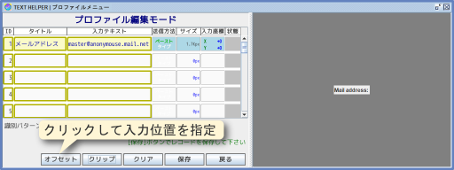
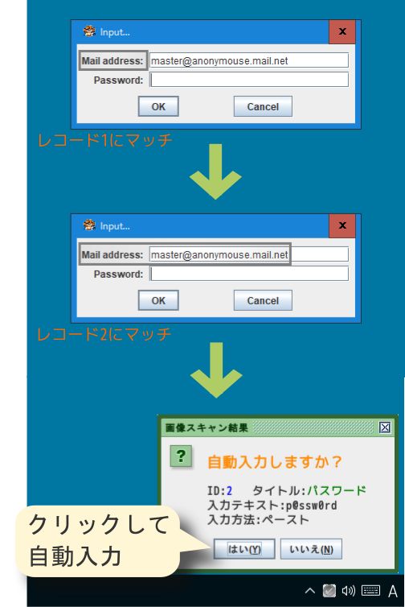

# 《 TEXT HELPER 》
*SikuliXによるサンプルRPAプログラム*

## 〔概要〕
誰でも無料で利用できるRPAツール[SikuliX](http://sikulix.com/)の機能を体験できるサンプルプログラムです。
ユーザーのテキスト入力操作をロボットが代行します。
Windows専用。日本語OSで日本語106キーボード使用をしている環境のみ対応しています。

## 〔使用方法〕

下図のようにメールアドレスとパスワードを入力してログインする、一般的なダイアログに対して、事前に登録したテキストを自動的入力するための設定作業を解説いたします。

<サンプルダイアログ> 

### 1. プログラムの起動

ダウンロードした[ZIPファイル][1]を展開したフォルダ内にある`TextHelper.wsf`ファイルまたはそのショートカットファイルをダブルクリックするなどして開くと、起動が開始されスプラッシュウィンドウが表示されます。

[1]: https://github.com/singularity-effect/TextHelper/releases/download/v1.0/TextHelper.zip

<スプラッシュウィンドウ> 
[][2]

[2]: https://raw.githubusercontent.com/singularity-effect/TextHelper/master/images/splash-image.png

スプラッシュウィンドウが消えて、タスクトレイにアイコンが常駐していれば、起動完了です。

<タスクトレイアイコン> 

### 2. タイトルと入力テキストの設定

<図2-1> 

タスクトレイの右クリックメニューから、［プロファイル］を選択し、プロファイルメニューを起動します。

<図2-2> 
[][2-2]

[2-2]: https://raw.githubusercontent.com/singularity-effect/TextHelper/master/images/figure2-2.png

選択モードから、［編集］ボタンをクリックして、編集モードへ移行します。

<図2-3> 
[][2-3]

[2-3]: https://raw.githubusercontent.com/singularity-effect/TextHelper/master/images/figure2-3.png

レコード1のタイトルと入力テキストのセルにそれぞれ文字列を入力します。［送信方法］はデフォルトで`ペースト`に設定されます。

### 3. 識別画像パターンの登録

<図3-1> 
[][3-1]

[3-1]: https://raw.githubusercontent.com/singularity-effect/TextHelper/master/images/figure3-1.png

［クリップ］ボタンをクリックして、画像クリップツールを起動します。

<図3-2> 
[][3-2]

[3-2]: https://raw.githubusercontent.com/singularity-effect/TextHelper/master/images/figure3-2.png

入力画面を識別するための画像パターンを決めて、マウスのドラッグにより矩形の領域を選択します。

<図3-3> 
[][3-3]

[3-3]: https://raw.githubusercontent.com/singularity-effect/TextHelper/master/images/figure3-3.png

選択した領域のサイズがキロピクセル単位で表示されます。

<図3-4> 

右クリックメニューから［セーブ］を選択すると、プロファイルに登録されます。

## 4. テキスト送信先の指定

<図4-1> 
[][4-1]

[4-1]: https://raw.githubusercontent.com/singularity-effect/TextHelper/master/images/figure4-1.png

編集メニューで［オフセット］ボタンをクリックして、テキストを送信する位置を指定するための座標取得ツールを起動します。

<図4-2> 
[][4-2]

[4-2]: https://raw.githubusercontent.com/singularity-effect/TextHelper/master/images/figure4-2.png

テキストを入力したい位置にマウスを合わせてクリックします。

<図4-3> 
[][4-3]

[4-3]: https://raw.githubusercontent.com/singularity-effect/TextHelper/master/images/figure4-3.png

識別画像の中心からの相対座標が表示されます。

<図4-4> 

右クリックメニューからセーブすれば、プロファイルに登録されます。

<図4-5> 
[][4-5]

[4-5]: https://raw.githubusercontent.com/singularity-effect/TextHelper/master/images/figure4-5.png

［保存］ボタンをクリックしてレコードを確定し、［戻る］ボタンで選択モードに戻ります。

## 5. 動作テスト

<図5-1> 
[][5-1]

[5-1]: https://raw.githubusercontent.com/singularity-effect/TextHelper/master/images/figure5-1.png

［テスト］ボタンをクリックして、レコード単体での動作テストが出来ます。

<図5-2> 

識別パターンが正しく認識できれば、指定の位置に自動的にテキストが入力されます。

## 6. 自動判定入力

複数のレコードから、マッチするものを自動的に選択して入力を実行する例を示します。

<図6-1> 
[][6-1]

[6-1]: https://raw.githubusercontent.com/singularity-effect/TextHelper/master/images/figure6-1.png

まずレコード2のタイトルと入力テキストを登録し、[図5-2][5-2]の状態で画像クリップツールを起動します。

<図6-2> 

次にレコード2の識別画像パターンを選択して登録します。

<図6-3> 

さらにレコード2の入力位置を指定して登録し、レコード2を保存します。

<図6-4> 
[][6-4]

[6-4]: https://raw.githubusercontent.com/singularity-effect/TextHelper/master/images/figure6-4.png

自動判定で使用するには、いったん選択モードに戻りプロファイルメニューを終了します。 
またダイアログを[初期状態][3]に戻してから開始することとします。

自動判定でのスキャン実行は、タスクトレイのアイコンを直接左クリックするか、右クリックメニューから［スキャン開始］を選択します。

[3]: https://raw.githubusercontent.com/singularity-effect/TextHelper/master/images/dialog.png

<図6-5> 

スキャン結果としてレコード1がマッチします。

<図6-6> 

［はい］をクリックして自動入力を実行すると、また[図5-2][5-2]の状態に戻ります。

ここからさらにスキャンを実行すると、今度はレコード1とレコード2が両方マッチします。

[5-2]: https://raw.githubusercontent.com/singularity-effect/TextHelper/master/images/figure5-2.png

<図6-7> 

このツールでは複数のパターンがマッチした場合は、マッチしたパターンの面積（ピクセル数の合計）が一番大きいものを採用する仕様となっています。
このケースではレコード2が採用され、パスワードが自動入力されます。

<図6-8> 

## 〔送信方法について〕

送信方法は`ペースト`の他、`タイプ`を指定することが出来ます。

<送信方法切り替え> 

送信方法が`タイプ`の設定では全角文字は使えず、半角英数字記号（ただしアンダーバー「_」以外）のみとなりますが、クリップボードからのペーストが禁止されている入力画面でも動作します。
例えば、リモートデスクトップのロック画面でも、パスワードの自動入力が可能です。

## 〔注意点〕

Webの場合はブラウザの設定によりフォントやズーム率が異なっていたり、またテキストボックスがフォーカスされているかどうかでデザインが変化するようになっていたりしますので、あまり適していません。 
そもそもブラウザ自体にログイン情報を保存する機能が備わっているので、このようなツールを必要としないでしょう。

自動判定の際は、有効なレコード数およびスキャンするウィンドウのサイズに比例して、スキャンにかかるオーバーヘッドが大きくなります。対策としては、一部のレコードを自動判定から除外してテスト機能を使ったり、スキャン中は一時的にウィンドウサイズを小さくするといった方法で、オーバーヘッドを小さく出来ます。
